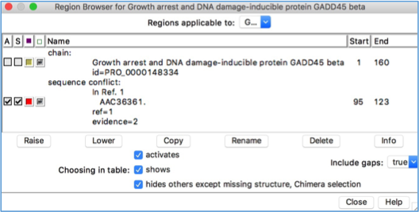

>layout: topic
>title: Homology modelling
>author: Allegra Via and Domenico Raimondo
>minutes: 1h30


#Tutorial on homology modelling with Chimera

------------

> ## Learning Objectives
>
> * Learners can upload a sequence from UniProt to Chimera
> Learners can perform a Blast search in the PDB
> * Learners can select a template 
> * Learners can build a model
> * Learners can edit, evaluate and refine the model

This tutorial is adapted from the [UCSF Chimera - Getting Started Tutorial](https://www.cgl.ucsf.edu/Outreach/Tutorials/GettingStarted.html)

This tutorial includes running Blast sequence search and Modeller comparative modeling calculations from Chimera. 
Modeller use requires a license key. Academic users can obtain a license key free of charge by registering at the Modeller website. 

###Background and Caveats
In comparative (homology) modeling, theoretical models of a protein are built using at least one known related structure and a sequence alignment of the known and unknown structures. The protein to be modeled is the target, and a related known structure used for modeling is a template. 

The target in this tutorial is the human GADD45 beta. This protein is involved in the regulation of growth and apoptosis. Its gene is a member of a group of genes whose transcript levels are increased following stressful growth arrest conditions and treatment with DNA-damaging agents. The genes in this group respond to environmental stresses by mediating activation of the p38/JNK pathway. 

At the time of creating this tutorial (May 2016), no structure was available for GADD45 beta. 

####Tutorial caveats: 
* As database contents and web services are updated, the results of calculations are likely to differ from what is described here. However, this tutorial is meant to illustrate the general process rather than any specific result. 
* This tutorial is not meant to indicate the optimal parameter settings for comparative modeling, as these will vary depending on the system of interest and the information available at the time. 
* This tutorial describes only one of several equally valid approaches. For example, the sequence of the target could be read from a FASTA file instead of fetched from the UniProt database. 
 
###Blast Search for Templates
* Start Chimera. A splash screen will appear, to be replaced in a few seconds by the main Chimera graphics window.

* Choose File... Fetch by ID from the menu and use the resulting dialog to fetch the sequence of the target, the human GADD45 beta: **UniProt ID is GA45B_HUMAN**

NOTE: If you want to verify the ID before fetching, click the Web Page button on the fetch dialog to see the corresponding page at UniProt. (One way to determine the ID in the first place is by searching at the UniProt site.)

* If you are happy with the sequence you selected, click on Fetch



The sequence is displayed in Multalign Viewer
  
and its UniProt feature annotations are listed in the Region Browser: 



The S column checkboxes in the Region Browser can be used to show feature annotations as coloured boxes in the sequence window. Close the Region Browser; it can be accessed at any time from the sequence window Info menu.

* The next step is to find a known protein structure suitable for use as a modeling template. We will use Chimera's Blast Protein tool to search the Protein Data Bank (PDB; a database of known structures) for sequences similar to the target. 

* From the sequence window menu, choose Info and then Blast Protein, click OK to use GA45B_HUMAN as the query, and OK again to perform the search **using default settings**, including pdb as the database to search.

NOTE: searching the pdb sequences should take only a few seconds. Searching the nr database, which also contains a huge number of sequences without known structures, would take much longer.

The Blast output will appear as follows:



In the Blast results dialog, the hits are listed from best to worst. Click the Columns button to reveal several checkboxes for controlling which columns of information are shown. Hide (uncheck) Description, then show Resolution and Chain names. As shown in the figure above, the two best hits are two other members of the same protein family, GADD45 alpha and GADD45 gamma, that have been already solved.

* It is possible to use multiple templates, but we will use just 3FFM_A (PDB entry 3FFM, chain A). In the Blast results dialog, click to highlight the corresponding row, then at the bottom of the dialog...
* ...click Show in MAV to display the query-hit sequence alignment from Blast in another Multalign Viewer (MAV) window.
* Click Load Structure in the Structure menu to fetch 3FFM from the PDB and open it in Chimera.
* Click Quit to dismiss the Blast results dialog.
* Show the Chimera Command Line (for example, with Favorites... Command Line), rainbow-color the ribbon using the following commands:

```
Command: ~display
Command: rainbow** 
```


You should obtain a similar represenatation of 3FFM, tracing the structure from N-terminus (blue) to C-terminus (red)

####Verifying the Alignment
Comparative modeling requires a template structure and a target-template sequence alignment. The sequence alignment is crucial; it determines which residues in the template are used to model which residues in the target, and any inaccuracies in the alignment will result in the use of incorrect constraints during 3D modeling. Regardless of how the sequence alignment was obtained, it should be examined and adjusted as needed before initiating the more computationally intensive 3D modeling calculations. 

An alignment was generated above as a by-product of the Blast similarity search. However, Blast is meant to identify local similarities quickly rather than to give accurate full-length alignments. 


NOTE: In general, if a Chimera window or dialog is obscured by other windows, it can be accessed from the Active Dialogs section of the Rapid Access interface (itself shown by clicking the lightning bolt icon near the bottom of the main Chimera window).


The alignment from Blast could be not adequate for modeling purposes. In this situation the target-template sequence alignment can be generated in some other ways and/or optimised. 

####Alignment optimization 
Click Quit to close the sequence alignment from Blast. To generate the target-template sequence alignment, we will return to the original GA45B_HUMAN (target) sequence and use the Needleman-Wunsch global alignment algorithm to add the sequence of the human GADD45 gamma (template).

NOTE: If you closed the sequence window, do not worry: the target sequence can be fetched again as described above or using in the Chimera command line window the following command: 

```
Command: open uniprot:GA45B_HUMAN
```

From the sequence window menu, choose Edit... Add Sequence. The resulting dialog contains tabs for different ways of obtaining the sequence. It is fine to add the template sequence From Structure. 
The template structure still needs to be associated with the corresponding sequence in the alignment. Click on OK. Sequences and structures will associate automatically. In the sequence window, the association is indicated with a coloured box around the sequence name.

NOTE: Red outline boxes enclose residues that are in the sequence but not in the associated structure. There are quite a few missing residues at the N-term. 

If you find the sequence coloring difficult to view, it can be changed to some other scheme (such as all black) using Preferences... Appearance in the sequence window menu. This also allows changing sequence wrapping, font size, etc. Coloring the sequence to match the structure ribbon is only one of several approaches for sequence-structure mapping. For example: 

1. highlighting residues in the sequence with the mouse selects them in the structure 
2. selecting residues in the structure highlights them in the sequence (green boxes) 
3. structure helix and strand assignments can be shown on the sequence with Structure... Secondary Structure... show actual 

####Running Modeller
From the sequence window menu, choose Structure... Modeller (homology) to open the Chimera interface to comparative modeling with Modeller. The target should be set to GA45B_HUMAN. Click 3FFM in the dialog to choose it as the template. 


Click the Advanced Options button to reveal additional settings. Run Modeller via web service. This indicates you are using a web service hosted by the UCSF RBVI. No local installation is required to run the web service, but it is necessary to enter a Modeller license key, available free of charge to academic users upon registration at the Modeller website (modeliranje). After entering the license key, click OK to launch the calculation with default settings. Five comparative models will be generated. The Modeller run may take several minutes and is handled as a background task. 
Clicking the information icon near the bottom of the Chimera window will bring up the Task Panel, in which the job can be canceled if desired. 


When the five models have been generated, they will be opened in Chimera and their evaluation scores shown in a Model List dialog.


The models can be viewed individually or collectively by choosing rows in the dialog with the mouse. The different scores from Modeller use different criteria and will not necessarily agree on which models are best: 

* GA341 - model score derived from statistical potentials; a value > 0.7 generally indicates a reliable model, >95% probability of having the correct fold 
* zDOPE - normalized Discrete Optimized Protein Energy (DOPE), an atomic distance-dependent statistical score; negative values indicate better models 

NOTE:  the GADD45 beta model termini extend beyond the template structure and therefore it cannot be modeled reliably.
Displaying all the models at once shows little conformational variability except in the N terminus (GADD sequence residues 1 to 11). This conclusion is reinforced by the RMSD histogram in the sequence window, where bar heights indicate root-mean-square distances among the atoms of the residues associated with a column. 


Although there is also a Chimera interface to Modeller for untemplated building and refinement, in this tutorial we will simply remove the termini and rescore the models. 


Click into the sequence window, then move the cursor over the residues to see the corresponding structure residue numbers near the bottom of the window. In the comparative models (#1.1-5), Lys-15 is aligned with the first residue in the template structure (Arg-18) and Glu-159 is aligned with the last residue in the template structure. Delete the termini in the comparative models that extend beyond the template: 

Command: del #1:start-14,160-end 


To rescore the models, choose Fetch Scores... zDOPE and Estimated RMSD/Overlap from the Model List menu. Rescoring uses a web service provided by the Sali lab at UCSF. After a minute or few, more favorable zDOPE values are obtained, along with the additional scores: 

* Estimated RMSD - TSVMod-predicted Cα root-mean-square deviation (RMSD) of the model from the native structure 
* Estimated Overlap (3.5 Å) - TSVMod-predicted native overlap (3.5 Å), fraction of Cα atoms in the model within 3.5 Å of the corresponding atoms in the native structure after rigid-body superposition 



The comparative models are atomically detailed and can be subjected to various analyses in Chimera. In the figure, the model with the best (lowest) estimated RMSD score is shown as spheres colored by amino acid hydrophobicity, from dodger blue for the most hydrophilic to white to orange red for the most hydrophobic (see color names). The Model List dialog was used to show only this model of the five, then the following commands were used to hide the template and adjust the model's appearance: 

```
Command: ~modeldisp #0 
Command: disp 
Command: ~ribbon 
Command: rangecol kdHydrophobicity min dodger blue mid white max orange red 
Command: preset apply pub 1 
Command: repr sphere 
```


Rotamers --> modification
